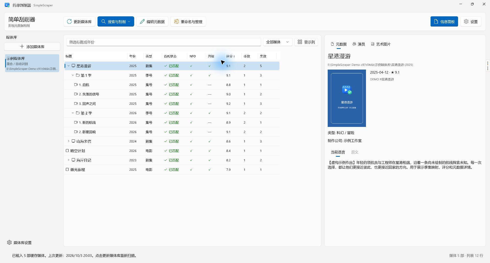
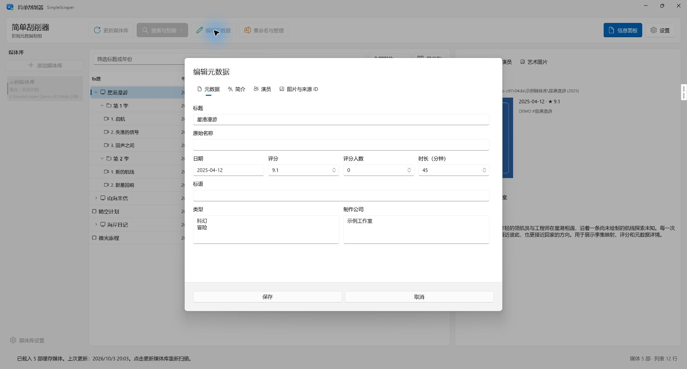

# 简单刮削器 · SimpleScraper


面向 Windows 的电影、电视剧与动画媒体库管理工具。中文原生界面，先确认匹配，再写入 NFO 和图片；重命名之前提供预览和冲突检查。

[下载 Windows 版本](https://github.com/v-hiker/simple-scraper/releases/latest) · [使用指南](docs/USER_GUIDE.md)

## 界面截图

以下为实际运行的应用窗口，媒体与元数据使用虚构示例。

媒体库列表：默认季数、集数和评分列，支持展开季与集，并查看作品详情。



元数据编辑：编辑作品标题、日期、评分、类型和制作信息。



## 功能

- 电影与剧集目录扫描、搜索、筛选、可配置列表列和季/集展开；默认显示季数、集数和评分。
- 默认使用 TMDB 搜索；可选择 Bangumi 或多来源匹配，支持分季来源、单集绑定及缺集检查。
- 作品、季与集的元数据编辑，演员和制作信息、海报、背景图和透明 PNG 标志。
- Jellyfin / Emby / Kodi 风格的 NFO 与图片输出；已存在文件默认保留，覆盖由具体操作明确触发。
- 文件与作品目录重命名预览、冲突检查、同名字幕处理和重命名历史。
- 简介翻译与本地缓存；设置中可选择翻译服务。
- 中文/英文界面，浅色、深色和系统主题，键盘操作及虚拟化列表。

## 使用

运行发布包中的 `SimpleScraper.exe`。第一次使用时添加媒体库；默认搜索来源为 TMDB，可在设置里调整来源和输出格式。集数列标题为“集数”，按作品/季显示计数，按单集显示编号；已有列显示偏好会保留。

TMDB 需要你自己的 API 密钥。设置里的“获取密钥”打开 [TMDB 官方设置](https://www.themoviedb.org/settings/api)。应用不附带密钥。Bangumi 可用于公开搜索。数据来源的服务条款与限额由各服务提供方规定。

个人设置、缓存和重命名历史存放在 `%LOCALAPPDATA%/SimpleScraper`。发布包和源码仓库不含个人配置。测试或便携环境可以设置 `SIMPLE_SCRAPER_DATA_HOME` 指定独立数据目录。

详见 [使用指南](docs/USER_GUIDE.md)。

## 开发

需要 Windows 10 1809 或更新版本、.NET 10 SDK、Windows SDK 构建工具和 Git。默认发布目标为 Windows x64。

在 PowerShell 中执行：

```powershell
./scripts/test.ps1
./scripts/build.ps1
```

默认构建输出为 `artifacts/app-release`，压缩发布包位于 `artifacts/releases`。脚本优先使用相邻 `../.tools/dotnet/dotnet.exe`，否则使用 PATH 中的 SDK。自动化测试只写隔离的临时目录，HTTP 使用模拟响应；实际验证范围见 [验证记录](docs/VALIDATION.md)。

## 架构与来源

三个项目分离业务契约、外部服务和 WinUI 桌面界面：[架构说明](docs/ARCHITECTURE.md)。迁移从已有的本地媒体库功能出发；仍需使用的上游实现已替换，旧向导、自动更新、原图标和原文档不进入新工程。新仓库使用独立提交历史。

[代码与素材来源记录](docs/PROVENANCE.md)说明保留与替换范围。技术审计记录不等同于权利归属的司法认定。

## 许可证

项目代码和本项目新增的 Fluent 图标采用 [MIT](LICENSE)。图标由内置 imagegen 工具生成，再转换为 PNG 和多尺寸 ICO，见 [图标生成记录](docs/icon-design.md)。第三方运行库、系统字体和网络服务遵循各自条款，见 [第三方说明](THIRD-PARTY-NOTICES.md)。媒体海报、演员照片及服务返回的数据不因应用使用 MIT 而改变其权利归属。

## 发布

GitHub Actions 在 Windows 上执行回归和 Release 构建。推送 `v0.1.0` 形式的版本标签后生成 GitHub Release。先完成本地验收，再按 [发布指南](docs/RELEASING.md)创建你的独立仓库。
