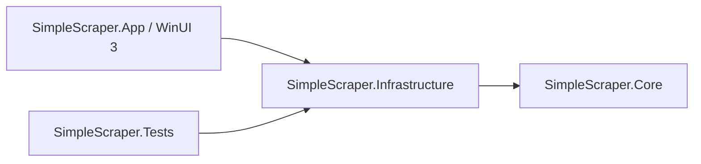

# 架构

## 依赖方向

Core 不引用 WinUI、HTTP 客户端或 Infrastructure。它定义媒体库/元数据模型、文件名识别、集数映射、编辑校验、展示列及输出策略。

Infrastructure 实现 TMDB/Bangumi、翻译服务、图片下载、目录扫描、NFO 输出、重命名、缓存和状态持久化。HTTP 可注入模拟客户端，配置路径可注入。数据目录通过 AppDataPaths 集中解析，构建位置不决定用户数据位置。

App 只负责 Windows 生命周期、窗口、交互和呈现。AppServices 是组合入口；LibraryPage 按布局、交互、目录管理、列表、详情、操作拆成多个 partial 文件。页面把网络、扫描和写入交给业务服务。partial 拆分减少单文件体积，仍共享同一页面状态；后续大型功能应先引入独立的协调器/视图模型，不继续扩充页面状态。

## 主流程

1. 读取媒体库配置和缓存；刷新扫描只读取媒体目录。
2. 搜索来源，展示候选结果，由用户确认作品与分季来源。
3. 编辑元数据、确认集数绑定，预览输出。
4. 写入 NFO 和缺失图片；重命名另行生成预览，检查冲突后执行。
5. 保存快照、绑定、偏好和重命名记录。

文件写入和下载以同目录临时文件完成后提交，现有图片默认不覆盖。对工作目录与集数映射的变更先校验，测试覆盖冲突和不修改源文件的情形。

## 默认展示与来源

Core 的 `LibraryColumns` 定义列清单和默认布局，Infrastructure 的状态存储保存用户的列顺序、宽度与可见性。新建或重置布局默认显示标题、年份、类型、匹配状态、NFO、海报、季数、集数和评分；恢复已保存布局时保留显式隐藏设置。集数列按作品/季显示文件计数，按单集显示集号，模糊编号仍保留原始线索供人工匹配。

Core 的 `AppConfig` 默认来源仅为 TMDB，搜索界面从配置读取所选来源；Bangumi 是可选来源。API 密钥默认为空。默认配置、模拟 HTTP 的适配器测试和真实服务联网验证是不同的检查范围。

## 扫描与列表计算

`LibraryScanner` 通过只读 `ILibraryScanFileSystem` 获取目录库存。一份库存同时保存文件和子目录，自动判断布局、视频识别和图片查找共用它；一次刷新中每个访问的目录只枚举一次，图片候选从库存查询，不逐个向网络盘探测文件。NFO 按需安全解析，解析缓存随作品扫描结束释放，下次刷新重新读取库存。

作品扫描默认最多并发四个，结果按原有文件夹排序返回，进度完成数保持单调。取消令牌在目录枚举、作品和文件处理之间检查；取消不提交部分扫描结果。扫描接口保留原调用参数，写入、重命名等流程继续使用各自的文件操作，不共用扫描快照。

Core 的 `EpisodeResolutionIndex` 为一次列表投影建立来源文档的季集号及 ID 索引，复用 `EpisodeMatching.Resolve` 的业务规则。App 的 `LibraryRowProjection` 将同一轮列表需要的计数与元数据集中计算。索引与投影不跨编辑或刷新缓存，改变绑定、编号或元数据后重建，避免展示旧结果。实测范围见 [性能记录](performance.md)。

## 工程约定

- UTF-8，无 BOM；固定 NuGet 包版本和锁文件。
- 所有终端脚本使用 PowerShell。
- Core 与 Infrastructure 不包含 Windows UI 类型；跨平台业务回归可在独立控制台执行。
- 桌面发布包自带 .NET 与 Windows App SDK，目标为 Windows x64。
- 网络响应中的密钥不进入错误消息；仓库不保存运行配置。
- 不嵌入原项目的更新地址，不自动从原仓库下载更新。
- 新功能以明确的数据模型和服务边界为入口；业务规则不写在 XAML 事件回调里。

## 测试边界

测试执行器复用本地媒体库改造阶段的行为回归，并增加替代适配器的配置、取消、重试、图片完整性与 HTTP 错误检查。它不使用真实媒体或个人密钥。Windows 发布构建与实际窗口验收分别记录；构建成功不能代替窗口交互验证。当前结果和未完成的交互验收见 [验证记录](VALIDATION.md)。
